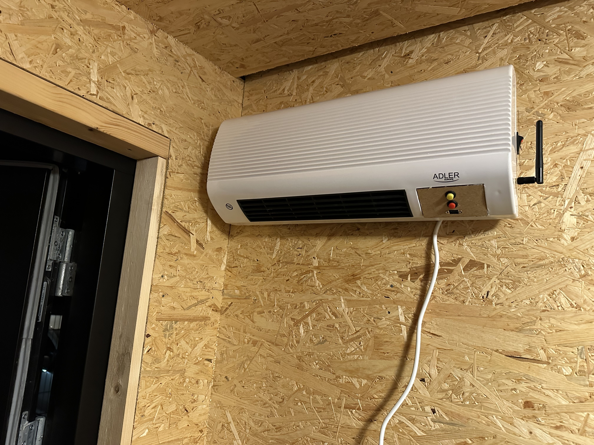

# Shed Heater 2000

This is a simple mod for a cheap wall mountable heater.

I've built it because the original controller didn't work as it was supposed to. So I figured out how the "motherboard" works, and made a new controller for it using an ESP8266.

The new controller implements a very simple hysteresis based temperature control, which should keep my shed above freezing during winter.

## Hardware

The original controller was connected to the "motherboard" using a ribbon cable with 6 wires. The pinout is as follows:

| Original cable | ESP8266                        | Function             |
|:--------------:|:------------------------------:|:--------------------:|
| 5:             | A0 (10k resistor to 3.3V)      | Thermistor           |
| 4:             | D2                             | Fan Active High      |
| 3:             | D7                             | Heater 2 Active High |
| 2:             | D6                             | Heater 1 Active High |
| 1: GND         | GND                            | Ground               |
| 0: +5V         | 5V                             | Power                |

| Button       | Pin | Function                                                                                                                |
|:------------:|:---:| :----------------------------------------------------------------------------------------------------------------------:|
| Red          | RST | Reset                                                                                                                   |
| Yellow       | D3  | When held during power up, go into flash mode. If pushed during start up, clear WiFi config and restore EEPROM defaults |

## BOM

- ESP8266 (Arbitrary dev board with external antenna connector)
- 10k resistor
- Two buttons
- One panel mountable USB plug
- One laser cut piece of MDF
- An opto isolator board so it is safe to have USB connected while the heater is powered (optional but recommended)
